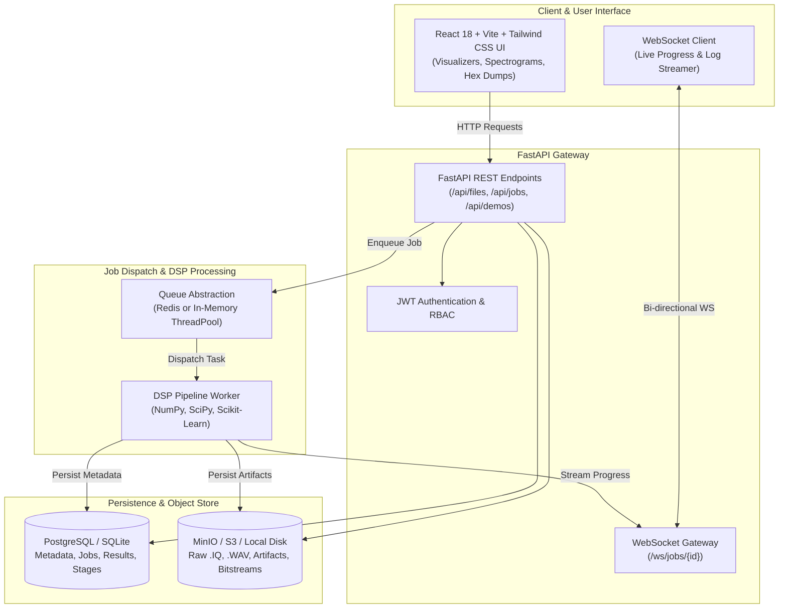

# SpectraSync: Platform Architecture & Design Document

## 1. System Overview

**SpectraSync** is an industrial-grade digital signal processing (DSP) and RF analysis platform that accepts raw `.IQ` and `.WAV` recordings and automatically transforms them into actionable physical and symbol insights.

The platform is designed around strict scientific provenance, mathematical rigor, and dual-mode runtime agility:
- **Zero-Dependency Local Mode**: Runs instantly out-of-the-box using SQLite, an in-memory thread pool queue, and local filesystem object storage.
- **Enterprise Distributed Mode**: Scales horizontally via Docker Compose or Kubernetes using PostgreSQL, Redis distributed job queues, MinIO/S3 object stores, and isolated DSP worker pools.

---

## 2. High-Level Architecture Diagram

---

## 3. Core Architectural Principles

### 3.1 Mathematical Rigor Over Mocking
All algorithms in SpectraSync are grounded in physical DSP theory:
- **Higher-Order Cumulants**: Circular vs non-circular cumulants ($C_{20}, C_{21}, C_{40}, C_{41}, C_{42}$) for blind modulation classification.
- **Gardner Timing Error Detection**: Non-data-aided feedback timing recovery with fractional polyphase interpolation.
- **Costas Phase-Locked Loops**: $M$-th power carrier frequency and phase acquisition for BPSK and QPSK constellations.
- **Algebraic Decoding**: True Berlekamp-Massey and Chien search for Reed-Solomon over Galois Field $GF(2^8)$ and Trellis Viterbi algorithm for NASA/CCSDS $K=7, r=1/2$ convolutional codes.

### 3.2 Strict Confidence & Provenance
Every output metric carries:
1. **Value**: The numerical estimate.
2. **Unit**: Physical SI unit (`Hz`, `baud`, `dB`, `samples`, `bits`).
3. **Confidence**: Normalized probability score $[0.0, 1.0]$.
4. **Source**: Origin of data (`metadata_header`, `dsp_estimate`, `ml_classifier`, `operator_override`).
5. **Method**: Mathematical algorithm utilized (`welch_periodogram`, `gardner_ted`, `parabolic_peak_fit`).
6. **Uncertainty**: Quantified margin of error ($\pm \Delta f$).

### 3.3 Dual-Mode Runtime Architecture
The system employs abstract base interfaces for infrastructure services:
| Service | Local Development Mode | Production Deployment Mode |
|---|---|---|
| **Database** | SQLite (`spectrasync.db`) | PostgreSQL 15 |
| **Task Queue** | `InMemoryQueue` (Concurrent ThreadPool) | `RedisQueue` (`redis://redis:6379`) |
| **Object Storage** | `LocalStorageBackend` (`./data/storage/`) | `MinioStorageBackend` (`s3://spectrasync/`) |

---

## 4. Database Schema

The persistence layer is managed via SQLAlchemy ORM:
- **`users`**: User identity, hashed passwords, roles (admin/analyst/viewer).
- **`signal_files`**: Ingested recording metadata, storage path, SHA-256 hash, byte size, format.
- **`analysis_jobs`**: Job status, queue priority, configuration parameters, timing telemetry.
- **`processing_stages`**: Granular stage-by-stage audit trail (13 stages per job) with timing in milliseconds, status, error messages, and stage quality metrics.
- **`analysis_results`**: Primary modulation, confidence, estimated parameters, synchronization data, demodulation summary, bit views.
- **`bitstreams`**: Raw recovered bits, hex stream, ASCII dump, bit density, transition metrics.
- **`artifacts`**: Exported report documents (JSON, CSV, HTML), plot images, and logs.

---

## 5. Authentication & Access Control (M6.1)

### 5.1 Architecture & Token Flow
- **Stateless JWT Tokens**: Upon successful authentication via `POST /api/auth/login`, the backend issues a signed JWT access token containing user identity and role claims.
- **Header Propagation**: Clients pass `Authorization: Bearer <token>` on all requests. Axios interceptors automatically inject this header and capture `401 Unauthorized` responses to redirect to `/login`.
- **Password Security**: Passwords are hashed using salted PBKDF2-HMAC-SHA256 (100,000 iterations) with constant-time verification to eliminate timing attacks.
- **Role-Based Authorization**: Roles (`analyst`, `admin`) govern operational capabilities.
- **Protected Surface**: All signal file ingestion, analysis job submission, DSP telemetry, and report generation endpoints require active authorization. Public endpoints are restricted to root, health checks, login, and the demo catalog list.

