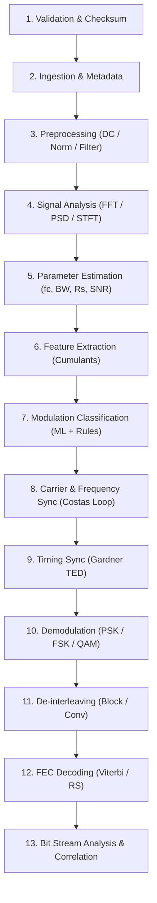

# SpectraSync: 13-Stage DSP Pipeline Specification

The SpectraSync analysis pipeline executes thirteen sequential processing stages to analyze an input RF recording. Each stage is isolated, timed with sub-millisecond precision, and emits structured telemetry.

---

## Pipeline Stage Breakdown

---

### Stage 1: File Validation & Checksum Verification
- **Algorithms**: SHA-256 cryptographic streaming digest; RIFF WAV container magic byte verification; complex64/int16 size boundary checks.
- **Fail-Fast Checks**: Rejects corrupted files, empty streams, or out-of-spec dimensions before compute allocation.

### Stage 2: Metadata Parsing & Signal Ingestion
- **Formats**: 
  - Standard PCM RIFF WAV (8-bit, 16-bit, 24-bit, 32-bit float; stereo pairs parsed as I/Q).
  - Raw binary `.iq` (interleaved 32-bit floating point complex64 or int16).
- **Internal Dataclass**: `SignalData` storing immutable sample arrays, sample rates, center frequencies, channel configuration, and duration.

### Stage 3: Preprocessing
- **DC Offset Removal**: Mean subtraction $\tilde{r}[n] = r[n] - \mu_r$ and single-pole high-pass IIR notch filter $y[n] = x[n] - x[n-1] + \alpha y[n-1]$.
- **Power Normalization**: Unit root-mean-square (RMS) normalization to ensure $E[|r[n]|^2] = 1.0$ for downstream feature invariance.
- **Selective Anti-Aliasing & Bandpass Filtering**: Digital Butterworth and Chebyshev IIR filters.

### Stage 4: Spectral & Time-Domain Analysis
- **Decimated Fast Fourier Transform (FFT)**: Hann/Hamming-windowed spectrum with dBFS dynamic scaling.
- **Welch Power Spectral Density (PSD)**: Averaged modified periodograms reducing variance across stationary segments.
- **Short-Time Fourier Transform (STFT)**: Time-frequency waterfall spectrogram matrix with adaptive resolution.
- **I/Q Scatter Constellation**: Raw trajectory downsampled for real-time visualization.

### Stage 5: Physical Parameter Estimation
- **Carrier Frequency Offset**: Coarse peak search combined with 3-point parabolic spectral peak interpolation $\Delta f = \frac{f_s}{2\pi} \cdot \delta_{bin}$.
- **Occupied Bandwidth (OBW)**: Integrates cumulative power spectral density to calculate the 99% enclosed power bandwidth and $-3\text{ dB}$ / $-20\text{ dB}$ skirts.
- **Symbol Rate Estimation**: Non-linear magnitude squaring $y[n] = |r[n]|^2$ followed by cyclic autocorrelation peak detection.
- **Signal-to-Noise Ratio (SNR)**: Out-of-band noise floor spectral estimation cross-verified against the $M_2M_4$ moment-based estimator.

### Stage 6 & 7: Modulation Feature Extraction & Classification
- **Higher-Order Cumulants**:
  $$C_{20} = M_{20}$$
  $$C_{21} = M_{21}$$
  $$C_{40} = M_{40} - 3C_{20}^2$$
  $$C_{42} = M_{42} - |C_{20}|^2 - 2C_{21}^2$$
- **Amplitude Features**: $\gamma_{max}$ (spectral peak of normalized instantaneous amplitude) and phase variance $\sigma_{dp}$.
- **Multi-Hypothesis Classifier**: Blends Random Forest machine learning with deterministic decision-tree rules. Flags impossible physical states (e.g. $R_s > B$) and gracefully outputs `UNKNOWN / AMBIGUOUS` under extreme distortion.

### Stage 8 & 9: Carrier & Timing Synchronization
- **Coarse Frequency Removal**: Multiplies baseband signal by $e^{-j 2\pi \hat{f}_{coarse} t}$.
- **Gardner Timing Error Detector (TED)**:
  $$e_{\tau}[k] = \text{Re}\left\{(r[k - 1/2])^* \cdot (r[k] - r[k-1])\right\}$$
  Drives a loop filter and polyphase interpolator to extract strobe-aligned symbol samples.
- **Costas Phase-Locked Loop**: Computes instantaneous phase error $e_{\phi} = \text{sign}(I) \cdot Q - \text{sign}(Q) \cdot I$ for QPSK, feeding a 2nd-order proportional-integral loop filter.

### Stage 10: Demodulation
- **PSK Demodulator**: Minimum-Euclidean distance slicer with Gray mapping; checks $90^\circ / 180^\circ$ rotational ambiguities against known preambles.
- **FSK Demodulator**: Quadrature discriminator and bank of matched filters detecting instantaneous tone shifts.
- **QAM Demodulator**: Rectangular grid slicer for 16-QAM constellation decision zones.

### Stage 11: De-interleaving
- **Matrix Block De-interleaver**: Evaluates $M \times N$ permutations with periodic autocorrelation tests.
- **Convolutional De-interleaver**: Forney/Ramsey delay branch shift registers.

### Stage 12: Forward Error Correction (FEC)
- **Viterbi Decoder**: NASA/CCSDS standard Rate 1/2, Constraint Length $K=7$ ($G_1=171_8, G_2=133_8$) hard-decision trellis path-search with 35-symbol traceback depth.
- **Reed-Solomon Decoder**: Algebraic Galois Field $GF(2^8)$ decoder with Berlekamp-Massey syndrome inversion and Chien search for error position location.

### Stage 13: Bit Stream Analysis & Correlation
- **Hex/ASCII/Binary Viewer**: Interactive byte-dump generation with bit density and entropy metrics.
- **Sync Header Scanning**: Fast bitwise sliding cross-correlation with Barker-7, Barker-11, Barker-13, CCSDS-32 (`0x1ACFFC1D`), AX.25 (`0x7E`), and Ethernet SFD (`0xD5`).
- **Pattern Cross-Correlation**: Produces normalized bipolar cross-correlation curves, peak lags, and bit-error rates against user-provided reference sequences.
